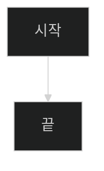
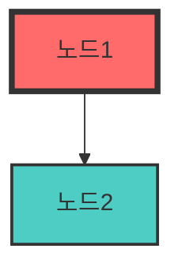
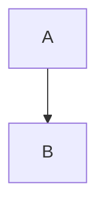

# 📊 Mermaid 다이어그램 보는 방법 가이드

Mermaid는 텍스트로 다이어그램을 작성할 수 있는 마크다운 확장 문법입니다.
이 가이드는 프로젝트의 Mermaid 다이어그램을 시각화하는 다양한 방법을 설명합니다.

---

## 🌟 방법 1: GitHub에서 직접 보기 (가장 쉬움!) ⭐

### 단계:
1. 웹 브라우저에서 GitHub 저장소 접속
   ```
   https://github.com/15tkdgns/cnn
   ```

2. `PROJECT_FLOW_MERMAID.md` 파일 클릭

3. 자동으로 렌더링된 다이어그램 확인!

### 장점:
- ✅ 설치 불필요
- ✅ 즉시 확인 가능
- ✅ 모바일에서도 볼 수 있음
- ✅ 공유하기 쉬움 (링크만 전달)

### 예시 링크:
```
https://github.com/15tkdgns/cnn/blob/main/PROJECT_FLOW_MERMAID.md
```

---

## 💻 방법 2: VS Code에서 보기

### 2-1. Mermaid 확장 프로그램 설치

#### 방법 A: 명령어로 설치
```bash
code --install-extension bierner.markdown-mermaid
```

#### 방법 B: VS Code 내에서 설치
1. VS Code 실행
2. 왼쪽 사이드바에서 확장 아이콘 클릭 (또는 `Ctrl+Shift+X`)
3. 검색창에 "Markdown Preview Mermaid Support" 입력
4. 설치 버튼 클릭

### 2-2. Mermaid 다이어그램 보기

```bash
# 1. 파일 열기
code PROJECT_FLOW_MERMAID.md

# 2. 마크다운 미리보기 열기
# Windows/Linux: Ctrl + Shift + V
# Mac: Cmd + Shift + V
```

### 2-3. 실시간 편집 (분할 화면)
```
1. 파일을 열고
2. Ctrl+K 누른 후 V 누르기
3. 왼쪽: 코드 편집, 오른쪽: 실시간 미리보기
```

### 장점:
- ✅ 실시간 편집 및 미리보기
- ✅ 오프라인 작업 가능
- ✅ 다른 코드와 함께 작업 가능

---

## 🌐 방법 3: 온라인 에디터 (mermaid.live)

### 단계:
1. 브라우저에서 접속
   ```
   https://mermaid.live
   ```

2. 왼쪽 에디터에 Mermaid 코드 붙여넣기

3. 오른쪽에서 실시간 렌더링 확인

### 예시: 시스템 아키텍처 다이어그램
```
PROJECT_FLOW_MERMAID.md 파일에서 코드 복사
→ mermaid.live에 붙여넣기
→ 실시간 시각화!
```

### 장점:
- ✅ 설치 불필요
- ✅ 실시간 편집
- ✅ PNG/SVG로 다운로드 가능
- ✅ 링크로 공유 가능

### 고급 기능:
- **테마 변경**: 상단에서 Dark/Light 테마 선택
- **다운로드**: PNG, SVG, Markdown 형식
- **공유**: URL로 다이어그램 공유

---

## 📱 방법 4: 모바일에서 보기

### Android/iOS:
1. **GitHub 앱 사용**
   - GitHub 공식 앱 설치
   - 저장소 접속
   - `PROJECT_FLOW_MERMAID.md` 열기
   - 자동 렌더링됨

2. **웹 브라우저 사용**
   - Chrome/Safari에서 GitHub 접속
   - 파일 직접 열기

---

## 🖼️ 방법 5: 이미지로 변환하기

### 5-1. Mermaid CLI 사용

```bash
# Mermaid CLI 설치
npm install -g @mermaid-js/mermaid-cli

# Markdown에서 이미지 추출
mmdc -i PROJECT_FLOW_MERMAID.md -o diagrams/

# 또는 특정 다이어그램만
mmdc -i diagram.mmd -o diagram.png
```

### 5-2. 온라인 변환
1. https://mermaid.live 접속
2. 다이어그램 코드 입력
3. 우측 상단 "Actions" → "PNG" 다운로드

---

## 📝 방법 6: 기타 마크다운 뷰어

### Obsidian
```
1. Obsidian 설치 (https://obsidian.md)
2. Vault에 프로젝트 폴더 추가
3. PROJECT_FLOW_MERMAID.md 열기
4. 자동 렌더링
```

### Typora
```
1. Typora 설치 (https://typora.io)
2. 파일 열기
3. 자동 렌더링
```

### Notion
```
1. Notion 페이지 생성
2. /code 블록 생성
3. 언어를 "mermaid" 선택
4. 코드 붙여넣기
```

---

## 🎨 다이어그램 커스터마이징

### 테마 변경
Mermaid 코드 상단에 추가:



### 사용 가능한 테마:
- `default` - 기본 테마
- `dark` - 다크 모드
- `forest` - 녹색 테마
- `neutral` - 중립 테마

### 색상 커스터마이징


---

## 🔧 트러블슈팅

### 문제 1: VS Code에서 렌더링 안 됨
**해결책:**
```bash
# 확장 프로그램 재설치
code --uninstall-extension bierner.markdown-mermaid
code --install-extension bierner.markdown-mermaid

# VS Code 재시작
```

### 문제 2: GitHub에서 렌더링 안 됨
**원인:** 코드 블록이 올바르지 않음

**올바른 형식:**
````markdown

````

**잘못된 형식:**
````markdown
```mmd
graph TD
    A --> B
```
````

### 문제 3: 다이어그램이 너무 복잡함
**해결책:**
- 온라인 에디터(mermaid.live)에서 확대/축소
- PNG로 다운로드하여 이미지 뷰어로 확인
- 다이어그램을 여러 개로 분리

---

## 📊 프로젝트의 주요 다이어그램

`PROJECT_FLOW_MERMAID.md` 파일에는 다음 다이어그램이 포함되어 있습니다:

1. **전체 시스템 아키텍처** (graph)
   - 훈련 단계 + 서비스 단계 구조

2. **모델 훈련 파이프라인** (flowchart)
   - 데이터 다운로드 → 전처리 → 훈련 → 저장

3. **API 서버 시작 과정** (flowchart)
   - FastAPI 초기화 → 모델 로드 → 서버 준비

4. **이미지 분류 요청 처리** (sequence diagram)
   - 클라이언트 ↔ 서버 ↔ 모델 통신 흐름

5. **Grad-CAM 생성 과정** (flowchart)
   - Forward/Backward Hook → CAM 계산 → 히트맵 생성

6. **YOLO 객체 탐지** (flowchart)
   - YOLO 추론 → NMS → 어노테이션

7. **프론트엔드 상호작용** (state diagram)
   - React 상태 전환 흐름

8. **데이터 변환 체인** (flowchart × 2)
   - 훈련 시 / 추론 시 데이터 변환

9. **전체 요청-응답 시퀀스** (sequence diagram)
   - 사용자 → 브라우저 → React → FastAPI → 모델

10. **성능 최적화 포인트** (mindmap)
    - 데이터 로딩, GPU, 추론, 네트워크 최적화

---

## 🎯 빠른 시작 체크리스트

### 처음 보는 사람이라면:

- [ ] **1단계**: GitHub에서 파일 확인 (가장 쉬움)
  ```
  https://github.com/15tkdgns/cnn/blob/main/PROJECT_FLOW_MERMAID.md
  ```

- [ ] **2단계**: 특정 다이어그램 복사
  - 원하는 다이어그램 코드 복사

- [ ] **3단계**: mermaid.live에서 편집
  ```
  https://mermaid.live
  ```

- [ ] **4단계**: PNG로 다운로드 (발표 자료용)

### 개발자라면:

- [ ] VS Code 확장 프로그램 설치
- [ ] 프로젝트 폴더에서 파일 열기
- [ ] `Ctrl+Shift+V`로 미리보기
- [ ] 필요 시 코드 수정 후 커밋

---

## 📚 추가 리소스

### 공식 문서
- Mermaid 공식 문서: https://mermaid.js.org/
- GitHub Mermaid 지원: https://github.blog/2022-02-14-include-diagrams-markdown-files-mermaid/

### 튜토리얼
- Mermaid Live Editor: https://mermaid.live
- Mermaid Cheat Sheet: https://jojozhuang.github.io/tutorial/mermaid-cheat-sheet/

### 예제 갤러리
- https://mermaid.js.org/ecosystem/integrations.html

---

## 💡 팁

### 발표 자료 준비 시:
1. GitHub에서 다이어그램 확인
2. mermaid.live에서 PNG로 다운로드
3. PowerPoint/Keynote에 삽입

### 문서 작성 시:
1. VS Code에서 실시간 미리보기로 작성
2. GitHub에 push하면 자동 렌더링

### 팀 공유 시:
1. GitHub 링크 공유
2. 또는 PNG 이미지 첨부

---

## ❓ 자주 묻는 질문

**Q: 다이어그램이 너무 큽니다. 어떻게 확대/축소하나요?**
A:
- GitHub: 브라우저 확대/축소 (`Ctrl + 마우스휠`)
- mermaid.live: 우측 상단 Zoom 버튼
- VS Code: 미리보기 창에서 확대/축소

**Q: 색상을 변경하고 싶어요.**
A: 다이어그램 코드에 `style` 명령어 추가:
```mermaid
style A fill:#f9f,stroke:#333,stroke-width:4px
```

**Q: 다이어그램을 이미지로 저장하려면?**
A:
1. mermaid.live에서 열기
2. 우측 상단 "Actions" → "PNG" 클릭
3. 저장

**Q: 모바일에서도 볼 수 있나요?**
A: 네! GitHub 앱이나 모바일 브라우저에서 확인 가능합니다.

---

**즐거운 다이어그램 탐험 되세요! 🚀**
