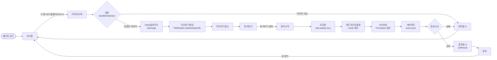

# Food-101 프로젝트 Mermaid 흐름도

이 문서는 프로젝트의 주요 흐름을 Mermaid 다이어그램으로 표현합니다.

## 목차
1. [전체 시스템 아키텍처](#1-전체-시스템-아키텍처)
2. [모델 훈련 파이프라인](#2-모델-훈련-파이프라인)
3. [API 서버 시작 과정](#3-api-서버-시작-과정)
4. [이미지 분류 요청 처리](#4-이미지-분류-요청-처리)
5. [Grad-CAM 생성 과정](#5-grad-cam-생성-과정)
6. [YOLO 객체 탐지](#6-yolo-객체-탐지)
7. [프론트엔드 상호작용](#7-프론트엔드-상호작용)
8. [데이터 변환 체인](#8-데이터-변환-체인)

---

## 1. 전체 시스템 아키텍처

---

## 2. 모델 훈련 파이프라인

```mermaid
flowchart LR
    Start([사용자 실행<br/>download_dataset.py]) --> A[Kaggle API 인증<br/>~/.kaggle/kaggle.json]
    A --> B[kagglehub.dataset_download]
    B --> C[데이터셋 다운로드<br/>~/.cache/kagglehub/food-101/]
    C --> D[dataset_path.txt 생성]

    D --> E[ImageFolder Dataset 초기화<br/>train: 75,750 images<br/>test: 25,250 images]

    E --> F[Transform 파이프라인<br/>1. Resize 256<br/>2. CenterCrop 224<br/>3. ToTensor<br/>4. Normalize]

    F --> G[DataLoader 설정<br/>batch_size: 128<br/>num_workers: 4<br/>prefetch_factor: 2]

    G --> H[ResNet18 로드<br/>ImageNet pretrained]
    H --> I[FC Layer 교체<br/>512 → 101 classes]
    I --> J[GPU로 모델 이동<br/>model.to cuda]

    J --> K{훈련 루프<br/>각 에폭마다}

    K --> L[Forward Pass<br/>images → model<br/>→ logits 128,101]
    L --> M[Loss 계산<br/>CrossEntropyLoss]
    M --> N[Backward Pass<br/>loss.backward]
    N --> O[Weight Update<br/>optimizer.step]

    O --> P[검증 단계<br/>torch.no_grad<br/>evaluate on test set]
    P --> Q{정확도 향상?}

    Q -->|Yes| R[Best Model 저장]
    Q -->|No| S[계속]
    R --> S
    S --> T{더 많은 에폭?}

    T -->|Yes| K
    T -->|No| End([최종 모델 저장<br/>best_model.pth<br/>epoch: 6<br/>accuracy: 76.32%])

    style Start fill:#e1f5ff
    style End fill:#ffe1e1
    style K fill:#fff5e1
    style Q fill:#ffe1ff
    style T fill:#ffe1ff
```

---

## 3. API 서버 시작 과정

```mermaid
flowchart LR
    Start([python api/main.py]) --> A[FastAPI 앱 초기화<br/>app = FastAPI]
    A --> B[CORS 미들웨어 추가<br/>allow_origins: *]
    B --> C[startup 이벤트 핸들러]

    C --> D1[Step 1: 디바이스 설정]
    D1 --> D2{torch.cuda.is_available?}
    D2 -->|Yes| D3[DEVICE = 'cuda']
    D2 -->|No| D4[DEVICE = 'cpu']
    D3 --> E
    D4 --> E

    E[Step 2: 클래스 로드] --> E1[dataset_path.txt 읽기]
    E1 --> E2[classes.txt 파싱]
    E2 --> E3[CLASSES = 101 items]

    E3 --> F[Step 3: Transform 파이프라인<br/>Resize, CenterCrop<br/>ToTensor, Normalize]

    F --> G[Step 4: ResNet18 모델 로드]
    G --> G1[get_model 101]
    G1 --> G2[resnet18 생성<br/>fc layer 교체]
    G2 --> G3[체크포인트 로드<br/>torch.load best_model.pth]
    G3 --> G4[가중치 적용<br/>model.load_state_dict]
    G4 --> G5[GPU로 이동<br/>model.to DEVICE]
    G5 --> G6[평가 모드<br/>model.eval]

    G6 --> H[Step 5: YOLO 초기화<br/>yolo11n.pt 다운로드<br/>GPU로 모델 로드]

    H --> End([서버 준비 완료<br/>http://localhost:8000<br/>Swagger UI: /docs<br/>헬스 체크: /health])

    style Start fill:#e1f5ff
    style End fill:#e1ffe1
    style D2 fill:#ffe1ff
```

---

## 4. 이미지 분류 요청 처리

---

## 5. Grad-CAM 생성 과정

```mermaid
flowchart LR
    Start([POST /predict/gradcam]) --> A[이미지 로드 & 전처리]

    A --> B[GradCAM 설정<br/>target_layer = layer4]

    B --> C[Forward Pass<br/>activations 저장<br/>shape: 1,512,7,7]

    C --> D[Backward Pass<br/>class_score.backward<br/>gradients 저장<br/>shape: 1,512,7,7]

    D --> E[CAM 계산<br/>weights = gradients.mean<br/>cam = weights * activations<br/>→ 1, 7, 7]

    E --> F[히트맵 생성<br/>resize → 224x224<br/>colormap JET 적용<br/>원본 이미지 오버레이]

    F --> G[Base64 인코딩<br/>PNG 형식]

    G --> End([JSON 응답<br/>gradcam: heatmap_image])

    style Start fill:#e1f5ff
    style End fill:#e1ffe1
    style E fill:#fff5e1
    style F fill:#ffe1ff
```

---

## 6. YOLO 객체 탐지

```mermaid
flowchart LR
    Start([POST /detect]) --> A[이미지 로드<br/>PIL Image → numpy array]

    A --> B[YOLO 전처리<br/>Letterbox resize → 640x640<br/>Normalize & Tensor 변환]

    B --> C[YOLO11n 추론<br/>model.predict<br/>conf threshold: 0.25]

    C --> D[NMS 후처리<br/>중복 박스 제거<br/>IoU threshold: 0.45]

    D --> E[결과 추출<br/>boxes, confidences, classes]

    E --> F[어노테이션 이미지 생성<br/>바운딩 박스 & 레이블 표시]

    F --> G[Base64 인코딩<br/>BGR → RGB → PNG]

    G --> End([JSON 응답<br/>detections & annotated_image])

    style Start fill:#e1f5ff
    style End fill:#e1ffe1
    style C fill:#fff5e1
    style D fill:#ffe1ff
```

---

## 7. 프론트엔드 상호작용

---

## 8. 데이터 변환 체인

### 8.1 훈련 시 데이터 변환

```mermaid
flowchart LR
    A[apple_pie/1001.jpg<br/>1.2MB, JPEG, 1024x768] --> B[PIL.Image.open<br/>RGB Mode<br/>Size: 1024, 768]

    B --> C[transforms.Resize 256<br/>Size: 256, 192<br/>aspect ratio 유지]

    C --> D[CenterCrop 224<br/>Size: 224, 224]

    D --> E[transforms.ToTensor<br/>Tensor 3, 224, 224<br/>dtype: float32<br/>range: 0.0-1.0]

    E --> F[transforms.Normalize<br/>mean: 0.485, 0.456, 0.406<br/>std: 0.229, 0.224, 0.225]

    F --> G[DataLoader 배치 생성<br/>Tensor 128, 3, 224, 224]

    G --> H[.to cuda<br/>GPU Memory 복사<br/>CUDA Tensor 128, 3, 224, 224]

    H --> I[ResNet18 Forward Pass]

    I --> I1[Conv1 7x7, stride=2<br/>→ 128, 64, 112, 112]
    I1 --> I2[MaxPool 3x3, stride=2<br/>→ 128, 64, 56, 56]
    I2 --> I3[Layer1 BasicBlock x 2<br/>→ 128, 64, 56, 56]
    I3 --> I4[Layer2 BasicBlock x 2<br/>→ 128, 128, 28, 28]
    I4 --> I5[Layer3 BasicBlock x 2<br/>→ 128, 256, 14, 14]
    I5 --> I6[Layer4 BasicBlock x 2<br/>→ 128, 512, 7, 7]
    I6 --> I7[AdaptiveAvgPool2d<br/>→ 128, 512, 1, 1]
    I7 --> I8[Flatten<br/>→ 128, 512]
    I8 --> I9[FC Layer 512 → 101<br/>→ 128, 101<br/>Logits]

    I9 --> J[CrossEntropyLoss<br/>input: 128, 101<br/>target: 128,<br/>→ scalar loss]

    J --> K[Backward Pass<br/>loss.backward<br/>→ Gradients 계산]

    K --> L[Optimizer Step<br/>Adam.step<br/>→ 가중치 업데이트]

    style A fill:#e1f5ff
    style L fill:#ffe1e1
    style I fill:#fff5e1
```

### 8.2 추론 시 데이터 변환

```mermaid
flowchart LR
    A[pizza.jpg<br/>245KB, JPEG] --> B[브라우저: File 객체<br/>type: image/jpeg<br/>size: 251234 bytes]

    B --> C[FileReader.readAsDataURL<br/>→ Data URL base64<br/>data:image/jpeg;base64,/9j/...]

    C --> D[미리보기 표시]

    C --> E[FormData.append file<br/>→ multipart/form-data]

    E --> F[HTTP POST → FastAPI<br/>Content-Type: multipart/form-data<br/>boundary: ----WebKit...]

    F --> G[await file.read<br/>→ bytes 바이너리<br/>len: 251234]

    G --> H[PIL.Image.open BytesIO<br/>→ PIL Image RGB<br/>Size: 800, 600]

    H --> I[TRANSFORM image<br/>• Resize 256 → 341, 256<br/>• CenterCrop 224 → 224, 224<br/>• ToTensor → 3, 224, 224<br/>• Normalize → 표준화]

    I --> J[.unsqueeze 0<br/>3, 224, 224 → 1, 3, 224, 224]

    J --> K[.to DEVICE<br/>→ GPU Tensor 1, 3, 224, 224]

    K --> L[with torch.no_grad:<br/>outputs = MODEL input_tensor<br/>→ Logits 1, 101<br/>예: -2.1, 0.5, ..., 5.2, ..., 1.3<br/>pizza=5.2 최대값]

    L --> M[torch.softmax outputs, dim=1<br/>→ Probabilities 101,<br/>예: 0.001, 0.003, ..., 0.852, ...<br/>pizza=0.852 85.2%<br/>P i = exp logit_i / Σ exp logit_j]

    M --> N[torch.topk probabilities, 5<br/>→ top5_values, top5_indices<br/>values: 0.852, 0.073, 0.041, 0.018, 0.009<br/>indices: 53, 72, 14, 89, 30]

    N --> O[.cpu.item<br/>GPU Tensor → Python float<br/>0.8523 85.23%]

    O --> P[JSON 직렬화<br/>success: true<br/>prediction: class: pizza, confidence: 0.8523<br/>top5: ...]

    P --> Q[HTTP Response<br/>HTTP/1.1 200 OK<br/>Content-Type: application/json]

    Q --> R[axios 파싱<br/>→ JavaScript 객체]

    R --> S[setResult response.data<br/>React State 업데이트]

    S --> T[화면 렌더링<br/>Pizza<br/>신뢰도: 85.23%<br/>Top 5 예측 바 차트]

    style A fill:#e1f5ff
    style D fill:#e1ffe1
    style T fill:#ffe1e1
    style L fill:#fff5e1
```

---

## 9. 전체 요청-응답 시퀀스 (통합)

---

## 10. 성능 최적화 포인트

---

## 사용 방법

### GitHub에서 보기
GitHub에서 이 파일을 보면 Mermaid 다이어그램이 자동으로 렌더링됩니다.

### VS Code에서 보기
1. Mermaid 확장 프로그램 설치: `Markdown Preview Mermaid Support`
2. 이 파일을 열고 `Ctrl+Shift+V` (마크다운 미리보기)

### 온라인 에디터
https://mermaid.live 에서 코드를 복사하여 실시간으로 편집 가능

---

## 관련 문서

- [PROJECT_FLOW_DIAGRAM.md](PROJECT_FLOW_DIAGRAM.md) - 텍스트 기반 상세 흐름도
- [DATA_FLOW.md](DATA_FLOW.md) - 데이터 흐름 상세 설명
- [README.md](README.md) - 프로젝트 소개
