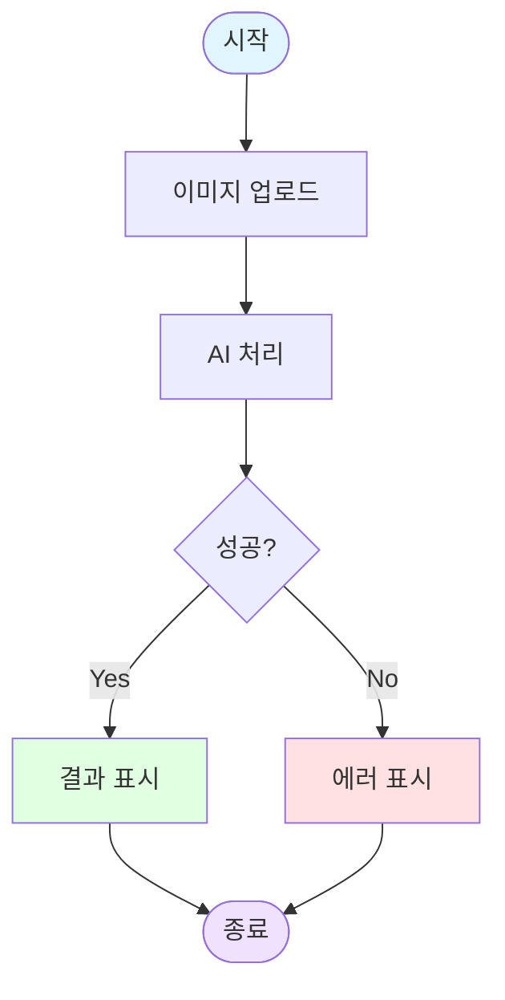
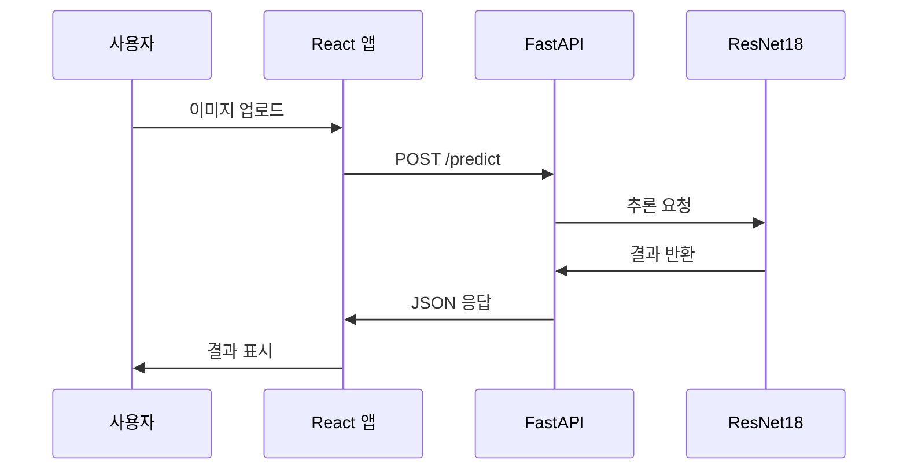
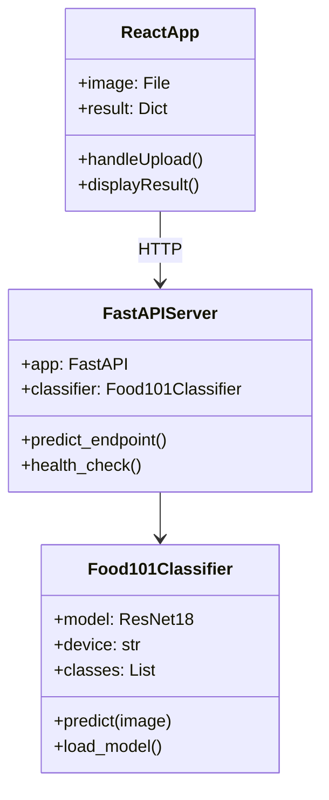
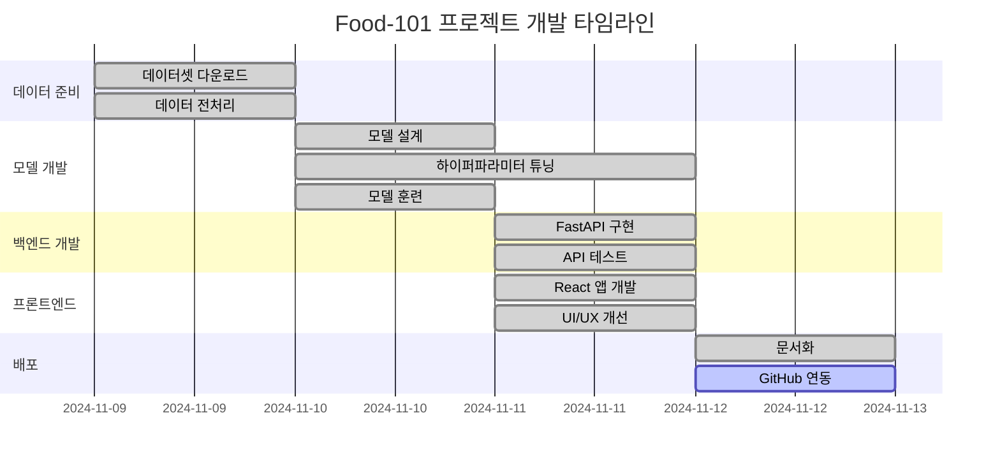
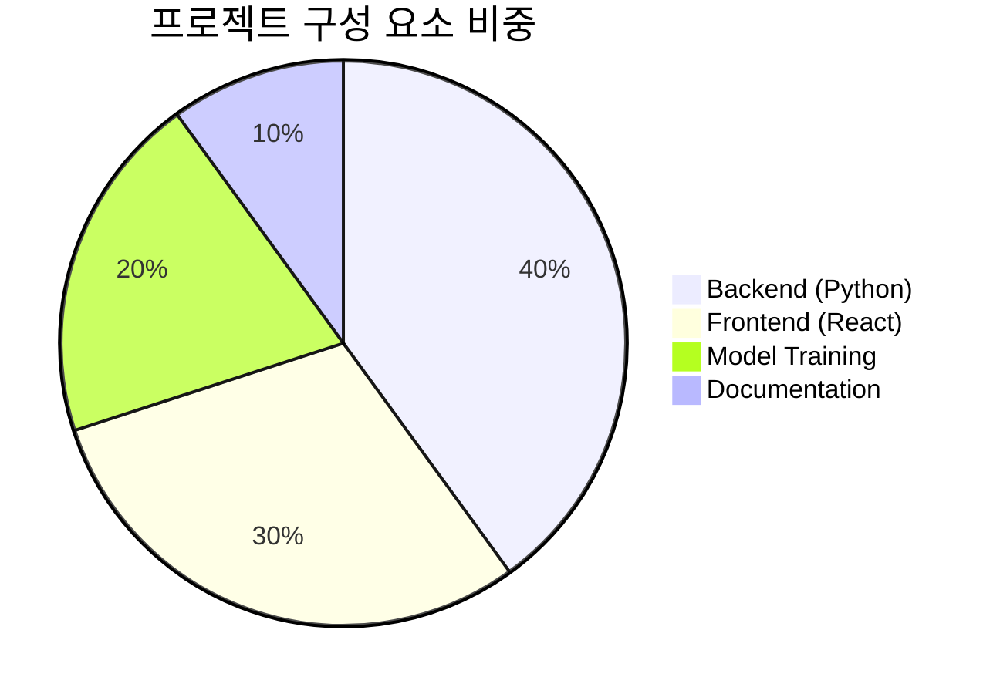
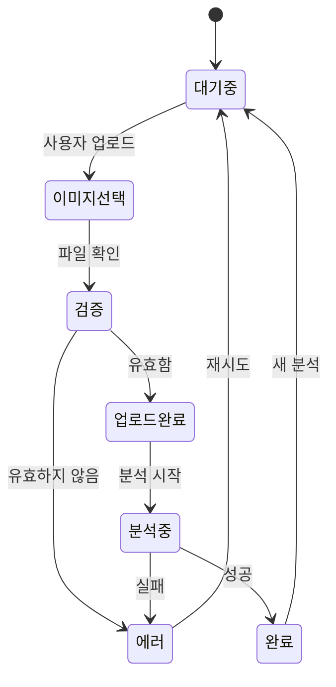
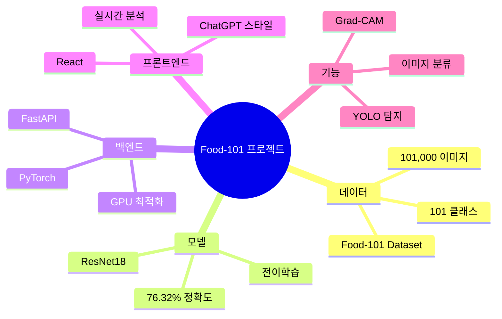

# Mermaid 다이어그램 예제

이 파일은 Mermaid 다이어그램이 어떻게 보이는지 테스트하기 위한 간단한 예제입니다.

## 예제 1: 간단한 플로우차트



## 예제 2: 시퀀스 다이어그램



## 예제 3: 클래스 다이어그램



## 예제 4: 간트 차트 (프로젝트 타임라인)



## 예제 5: 파이 차트



## 예제 6: 상태 다이어그램



## 예제 7: 마인드맵



## 이 파일을 보는 방법

### 1. GitHub에서 보기 (추천)
```
https://github.com/15tkdgns/cnn/blob/main/mermaid_example.md
```
→ 자동으로 렌더링됩니다!

### 2. VS Code에서 보기
```bash
# 1. Mermaid 확장 프로그램 설치
code --install-extension bierner.markdown-mermaid

# 2. 파일 열고 미리보기
code mermaid_example.md
# Ctrl+Shift+V 눌러서 미리보기
```

### 3. 온라인에서 보기
1. https://mermaid.live 접속
2. 위 코드 복사 & 붙여넣기
3. 실시간 렌더링 확인!

---

**참고:** 모든 다이어그램이 즉시 렌더링되는지 확인하려면 GitHub에서 이 파일을 열어보세요!
